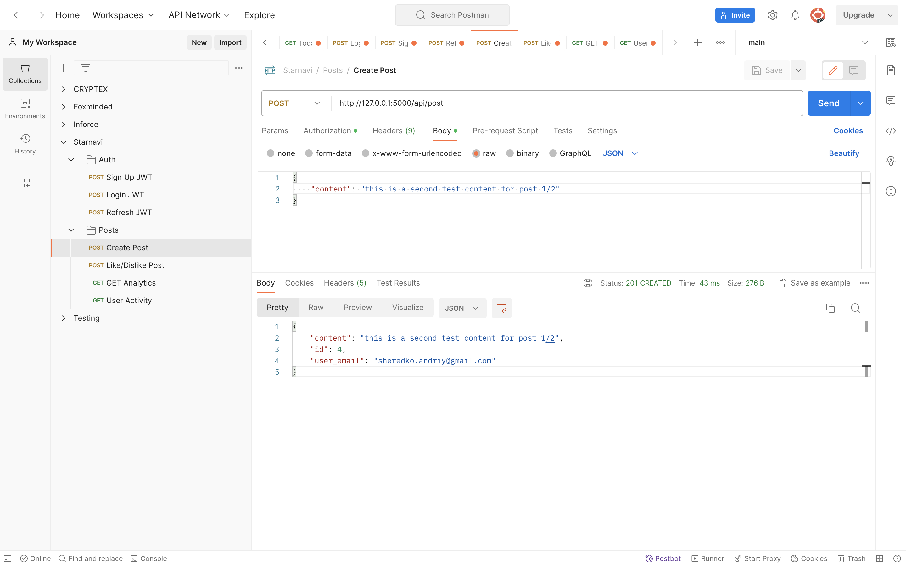

# Social Network REST API

This project is a simple REST API for a social networking application using Flask. It demonstrates basic CRUD operations for user management and post interactions within the network.

## Features

- **User Registration**: Sign up with an email and password.
- **User Authentication**: Secure login with JWT token authentication.
- **Post Creation**: Authenticated users can create posts.
- **Post Like/Unlike**: Users can like or unlike posts.
- **Analytics**: View count of likes aggregated by day within a date range with flexible query parameters.
- **User Activity**: Check the last login time and last request made by a user.

## Installation

To set up the project for development or testing:

1. Clone the repository `git clone <url>`.
2. Install the dependencies using `pip install -r requirements.txt`.
3. Run the Flask application with `python run.py`.

## Configuration

- The application reads from a `config.json` for bot activities, structured as follows:

```json
{
    "number_of_users": "Number of users to simulate",
    "max_posts_per_user": "Maximum number of posts per user",
    "max_likes_per_user": "Maximum number of likes per user"
}
```

## Testing

The API functionalities can be tested using the following methods:

- **Automated Bot**: Run `bot.py` to simulate user activity on the network after configuring `config.json` file.
- **Postman**: Manual testing can be done also by using `Postman` for each endpoint as I did.

   

## Endpoints

The API provides the following endpoints:

- `POST localhost/api/signup`: Register a new user.
- `POST localhost/api/login`: Login for existing users and retrieve a token.
- `POST localhost/api/token/refresh`: Refresh the access token using the refresh token.
- `POST localhost/api/post`: Create a new post.
- `POST localhost/api/post/<post_id>/like`: Like a post.
- `POST localhost/api/post/<post_id>/unlike`: Unlike a post.
- `GET localhost/api/analytics/?date_from=YYYY-MM-DD&date_to=YYYY-MM-DD`: Get like analytics with the flexibility of specifying either start date, end date, or both.
- `GET localhost/api/activity`: Get user's last login and request activity.

## Design Decisions

- Flask was chosen due to its simplicity and extensibility for small to medium-sized applications.
- JWT was used for authentication to provide a stateless authentication mechanism. A refresh token feature was implemented to allow users to remain logged in securely without re-entering credentials.
- The analytics endpoint was designed with flexibility in mind, allowing users to retrieve data by specifying either a date_from, date_to, or both to accommodate various user needs.

<hr>

### To run autopep8 on a file:
```shell
autopep8 --in-place --aggressive --aggressive <filename>
```

## Contributor

- Andrew Sheredko
